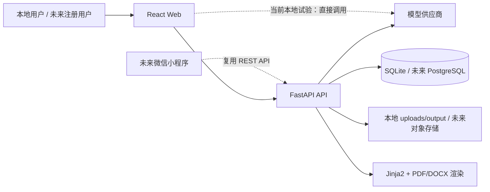
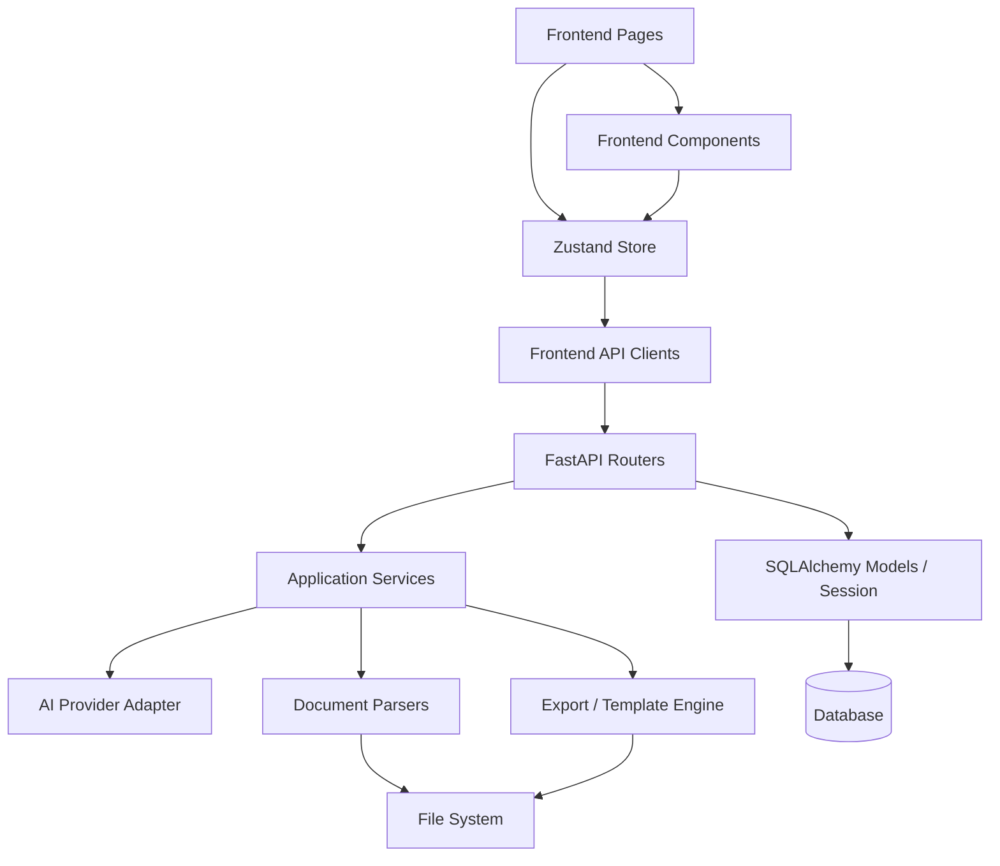
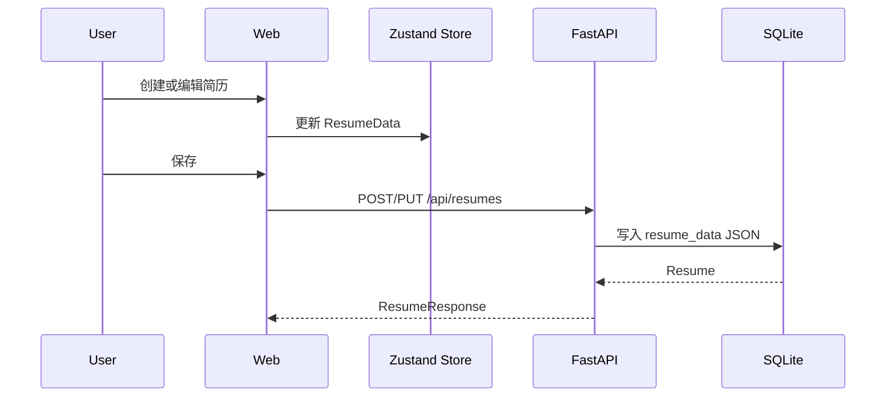
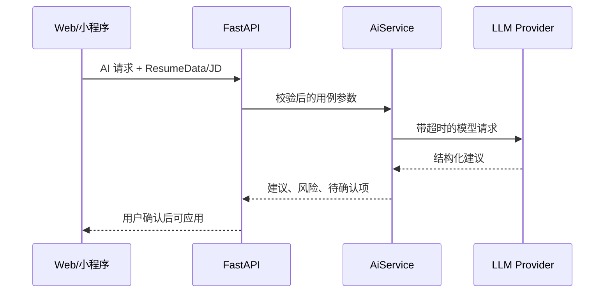

# System Architecture

> 状态：当前实现与目标架构并列记录  
> 最后核对：2026-06-08

## 1. System Purpose

AI 简历工坊将用户输入、已有简历和目标岗位信息转换为结构化 `ResumeData`，再通过编辑、AI 建议、模板渲染和导出形成可投递简历。

当前是本地优先的模块化单体：

- React/Vite Web 客户端。
- FastAPI 单体 API。
- SQLite 本地数据库。
- 本地上传和导出目录。
- OpenAI 兼容模型服务。

未来服务器版与微信小程序继续复用后端 API 和规范简历数据，不复用 React 页面代码。

## 2. Context



浏览器直连模型供应商是当前实现，不是目标架构。服务器上线前必须把密钥和模型调用收口到后端。

## 3. Runtime Units

### Web Client

入口：`frontend/src/main.tsx`、`frontend/src/App.tsx`

职责：

- 页面路由和应用壳。
- 简历结构化编辑与实时预览。
- 客户端交互状态和部分持久化。
- 调用简历、AI、导入、导出 API。

当前路由：

- `/`: 工作台。
- `/resumes`: 简历管理。
- `/editor/:id?`: 编辑器。
- `/templates`: 模板中心。
- `/import`: 导入导出。
- `/exports`: 导出记录。
- `/ai`: AI 工具。
- `/jobs`: 岗位推荐。
- `/settings`: 设置。

### API Service

入口：`backend/app/main.py`

职责：

- 简历 CRUD。
- AI 改写、诊断、JD 匹配等模型编排。
- PDF、DOCX、TXT、JSON 导出。
- PDF、DOCX、TXT、JSON 导入与结构化。
- 模板查询和渲染。
- 设置持久化。

当前实际注册：`resumes`、`ai`、`export`、`import_`。

当前存在但尚未注册：`settings`、`templates`。在 `main.py` 注册前，这些接口不可访问。

### Persistence

- SQLAlchemy ORM。
- SQLite URL 默认 `sqlite:///./data/resume_workshop.db`。
- 启动时使用 `Base.metadata.create_all`。
- 表：`resumes`、`ai_logs`、`export_records`、`settings`。

目标：

- 引入 Alembic 迁移。
- 上线时切换 PostgreSQL。
- 所有用户数据增加明确归属和对象级授权。

### File and Rendering

- 上传目录：`backend/uploads/`。
- 导出目录：`backend/output/`。
- 模板：`backend/app/templates/<template-id>/resume.html`。
- HTML 模板由 Jinja2 渲染。
- 导出服务负责 PDF、DOCX、TXT、JSON。

## 4. Module Boundaries



允许依赖方向：

```text
Page/Component -> Store/API Client -> Router -> Service -> Infrastructure
                                    Router -> Schema/Database Session
```

禁止：

- Service 导入 Router 或 FastAPI Request。
- 后端业务模块依赖前端类型文件。
- 页面直接访问数据库或本地后端文件。
- 小程序复制一套独立业务规则。
- Router 长期承载模板、AI 或导入导出核心逻辑。

## 5. Canonical Data

`ResumeData` 是核心契约，当前包含：

- `basics`
- `target`
- `summary`
- `work`
- `projects`
- `education`
- `skills`
- 其他扩展板块

数据库当前把该结构序列化为 `resumes.resume_data` 文本 JSON。前端 TypeScript 类型与后端 Pydantic Schema 目前分别维护，存在漂移风险。

目标：

1. 使用 JSON Schema 或 OpenAPI 作为机器可读契约。
2. 自动生成或校验前端类型。
3. Schema 变更提供版本和迁移策略。
4. Web 与小程序只负责展示和交互，共享同一契约。

## 6. Core Flows

### Create and Edit



### AI Optimization

目标流：



AI 不得捏造经历、数据、奖项或技能。建议必须与原文分离，用户确认后才写回简历。

### Import

```text
上传文件 -> 类型/大小校验 -> 提取文本 -> 结构化 -> 字段校验
-> 用户预览确认 -> 保存 ResumeData
```

### Export

```text
加载 ResumeData -> 选择模板 -> 渲染/生成 -> 写入 output
-> 记录 ExportRecord -> 返回下载
```

## 7. Current Gaps

| Gap | Current State | Required Direction |
|---|---|---|
| AI 密钥 | 前端 store/localStorage 保存并可直连供应商 | 服务器版只存服务端 Secrets |
| Router 接线 | settings/templates 未注册 | 注册并增加测试 |
| CORS | `allow_origins=["*"]` 且允许凭据 | 按环境限制来源 |
| 数据库迁移 | 启动时 `create_all` | Alembic |
| 契约同步 | TS 与 Pydantic 手工维护 | OpenAPI/JSON Schema 驱动 |
| 测试 | 无自动测试目录 | 单元、API、E2E、导出回归 |
| 依赖声明 | requirements 与实际 import 不一致 | 锁定完整依赖 |
| mock 边界 | 模板、岗位、导出记录等混有 mock | 明确 mock adapter 或真实 API |
| 文件安全 | 缺少统一大小、生命周期和清理约束 | FileService + 校验 + 清理 |
| 线上身份 | 无用户与授权 | 登录、owner_id、对象级授权 |

## 8. Evolution

```text
本地模块化单体
  -> 契约与测试稳定
  -> PostgreSQL + 对象存储 + 用户鉴权
  -> 异步导出/任务队列（有真实压力后）
  -> 微信小程序客户端
```

不因“未来可能需要”提前拆微服务。只有独立扩缩容、隔离故障或团队所有权出现真实需求时再拆分。

## 9. Detailed Documents

- [系统设计](docs/architecture/system-design.md)
- [ADR-0001：模块化单体与 API 优先](docs/architecture/adr/0001-modular-monolith-api-first.md)
- [ADR-0002：规范简历 JSON](docs/architecture/adr/0002-canonical-resume-json.md)
- [ADR-0003：AI 供应商边界](docs/architecture/adr/0003-ai-provider-boundary.md)
- [API 快照](docs/generated/api-inventory.md)
- [数据模型快照](docs/generated/data-model.md)

