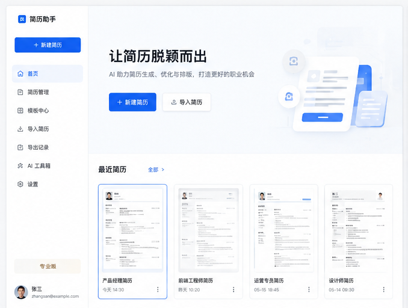
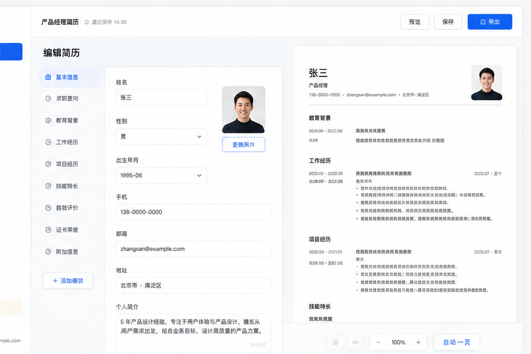
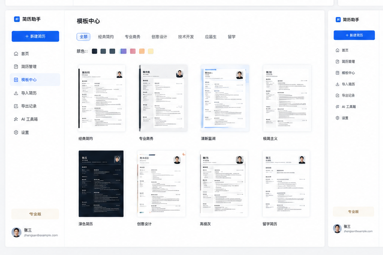
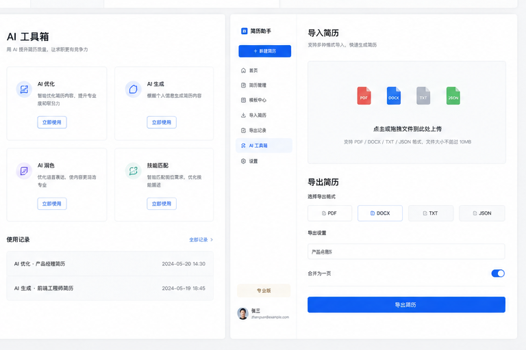

# Personal-Resume

## 项目名称

AI简历工坊 - AI驱动的简历生成与优化平台

## 一句话介绍

一款帮助用户创建、修改、优化简历的AI工具，支持PDF/Word/Text/JSON等多种格式导入导出，提供专业的AI优化建议和岗位推荐功能。

## 功能列表

- ✅ **简历管理**：创建、编辑、删除、复制多份简历
- ✅ **结构化编辑**：个人信息、教育背景、工作经历、项目经验、技能证书等板块编辑
- ✅ **实时预览**：多模板支持，所见即所得
- ✅ **AI优化**：全文诊断、单条优化、量化建议、岗位匹配
- ✅ **多格式导入**：支持PDF、DOCX、TXT、JSON导入并解析
- ✅ **多格式导出**：PDF、DOCX、TXT、JSON导出
- ✅ **模板中心**：多款专业简历模板（现代、经典、简洁）
- ✅ **岗位推荐**：根据简历内容推荐匹配岗位
- ✅ **本地部署**：数据本地存储，隐私安全

## 环境要求

- **Node.js**: 18+ (推荐 20+)
- **Python**: 3.10+
- **Git**: 最新版本
- **浏览器**: Chrome/Edge/Firefox最新版本
- **AI服务**: DeepSeek API Key 或其他OpenAI兼容接口

## 安装步骤

### 1. 克隆项目
```bash
git clone https://github.com/easterndd/Personal-Resume.git
cd Personal-Resume
```

### 2. 安装前端依赖
```bash
cd frontend
npm install
```

### 3. 安装后端依赖
```bash
cd ../backend
python -m venv .venv
# Windows
.venv\Scripts\activate
# Linux/Mac
source .venv/bin/activate

pip install -r requirements.txt

# 安装Playwright浏览器 (用于PDF导出)
playwright install chromium
```

### 4. 配置环境变量
```bash
cd backend
cp .env.example .env
# 编辑 .env 文件，填入你的 API Key 等配置
```

## 运行示例

### 启动后端服务
```bash
cd backend
.venv\Scripts\activate
uvicorn app.main:app --reload --port 8000
```

后端API文档: http://localhost:8000/docs

### 启动前端服务
```bash
cd frontend
npm run dev
```

前端访问地址: http://localhost:5173

### 使用流程

1. 打开浏览器访问 http://localhost:5173
2. 点击「新建简历」创建新简历或从文件导入
3. 在编辑器中完善简历内容
4. 打开AI助手获取优化建议
5. 选择合适的简历模板
6. 导出为PDF或其他格式

## 项目结构说明

```
Personal-Resume/
├── frontend/                    # 前端应用
│   ├── src/
│   │   ├── api/                # API客户端
│   │   ├── components/         # React组件
│   │   ├── pages/             # 页面组件
│   │   ├── store/             # Zustand状态管理
│   │   ├── types/             # TypeScript类型
│   │   └── utils/             # 工具函数
│   ├── package.json
│   └── vite.config.ts
├── backend/                    # 后端服务
│   ├── app/
│   │   ├── routers/           # API路由
│   │   ├── services/          # 业务逻辑
│   │   ├── templates/         # 简历模板
│   │   ├── models.py          # 数据模型
│   │   └── main.py            # FastAPI入口
│   ├── data/                  # SQLite数据库
│   ├── uploads/               # 上传文件
│   ├── output/                # 导出文件
│   └── requirements.txt
├── MD/                         # 项目文档
│   ├── 本地AI简历工坊开发落地方案.md
│   ├── 竞品分析与差异化升级方案.md
│   └── 项目开发实现方案.md
├── tool/                       # 工具脚本
│   └── push_to_github.py      # Git同步工具
├── AGENTS.md                   # AI协作指南
└── README.md                   # 项目说明
```

## 主要功能与实现方式

### 简历数据结构
采用兼容JSON Resume标准的结构化数据格式，包含：
- 个人基础信息
- 教育背景
- 工作经历
- 项目经验
- 技能特长
- 证书奖项
- 自定义板块

### AI优化策略
1. **全文诊断**：分析简历结构、内容完整性、专业度
2. **单条优化**：针对具体经历提供STAR原则优化
3. **量化建议**：突出数据和成果，使用主动动词
4. **岗位匹配**：根据JD提取关键词，优化简历内容
5. **中英翻译**：一键生成中英文双语简历

### 模板渲染
- 使用HTML + CSS + Jinja2模板引擎
- Playwright渲染生成高保真PDF
- 支持A4尺寸、打印样式优化

### 文档解析
- PDF：PyMuPDF提取文本 + AI结构化
- DOCX：python-docx解析 + AI结构化
- TXT/JSON：直接处理

## 截图






## 开发路线

- [x] MVP核心功能：简历编辑、预览、PDF导出
- [x] AI集成：基础优化功能
- [ ] 导入功能完善：PDF/DOCX智能解析
- [ ] DOCX导出支持
- [ ] 岗位推荐功能
- [ ] 更多专业模板
- [ ] 服务器部署版本
- [ ] 微信小程序版本

## 贡献指南

欢迎提交Issue和PR！请先阅读AGENTS.md了解项目开发规范。

## 许可证

MIT License
