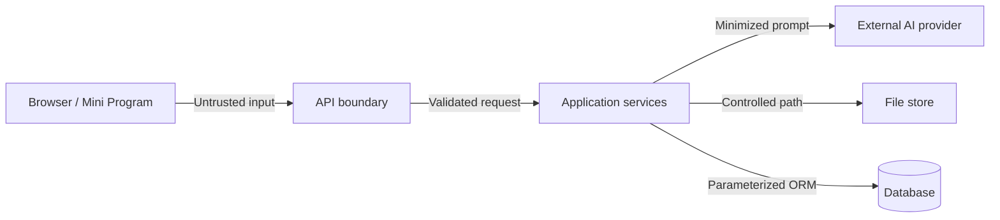

# Detailed System Design

> 状态：Active  
> 描述当前实现，并规定下一步演进边界。

## Frontend

### Composition

```text
App routes
  -> page components
    -> domain/common components
      -> Zustand store and API clients
```

页面：

- `Dashboard`: 入口和概览。
- `ResumeManager`: 简历列表和操作。
- `Editor`: 结构化编辑与预览。
- `Templates`: 模板浏览。
- `ImportExport`: 文件导入导出。
- `ExportRecords`: 当前为 mock 导出记录。
- `AiTools`: AI 工具入口。
- `JobRecommendations`: 当前主要基于 mock 岗位。
- `SettingsPage`: 模型供应商与本地设置。

### State

`resumeStore.ts` 当前同时负责：

- 简历编辑状态。
- 后端简历 CRUD。
- 模板 mock。
- 岗位 mock 和投递状态。
- AI 设置和建议。
- Toast 与 loading。
- Zustand persist。

这是可运行的 MVP 结构，但继续扩展会让修改影响面过大。建议按以下切片拆分：

```text
features/resumes/
features/editor/
features/ai/
features/templates/
features/import-export/
features/jobs/
shared/api/
shared/ui/
```

拆分应以真实需求和测试为前提，不做一次性全仓库重构。

### API

当前 `frontend/src/api/` 每个文件各自创建 Axios 实例。目标是：

- 一个共享 HTTP Client。
- 统一 base URL、超时、错误映射和请求 ID。
- API 类型来自 OpenAPI。
- 客户端不保存服务端内部错误。

### Local Persistence

Zustand persist 和 `SettingsPage` localStorage 会保存 AI 设置，其中可能包含 API Key。

允许范围：

- 仅本地单机试验。
- UI 明确提示密钥存储于当前浏览器。
- 不在共享电脑使用。

服务器版禁止：

- 把平台密钥放到浏览器。
- 从 Web 或小程序直连模型供应商。
- 把 Secret 从后端返回客户端。

## Backend

### Interface Layer

`backend/app/routers/` 负责：

- 路由和 HTTP 方法。
- Pydantic 输入输出。
- 依赖注入。
- 状态码与错误映射。

Router 不应：

- 拼装大段 prompt。
- 实现文档解析算法。
- 拼接模板 HTML。
- 处理文件存储细节。
- 返回未经清理的异常字符串。

### Application Services

- `AiService`: 供应商选择、prompt 和响应解析。
- `ImportService`: 文本提取、结构化和校验。
- `ExportService`: 多格式导出和文件生成。
- `TemplateService`: 模板元数据和 Jinja2 渲染。

目标接口：

```python
class AiProvider(Protocol):
    async def complete(self, request: AiRequest) -> AiResult: ...

class FileStore(Protocol):
    async def save(self, file: BinaryIO, metadata: FileMetadata) -> StoredFile: ...
    async def delete(self, key: str) -> None: ...

class ResumeRepository(Protocol):
    def get(self, resume_id: str, owner_id: str | None) -> Resume: ...
```

只有出现第二种实现或测试替身确实受益时才引入接口，不为抽象而抽象。

### Persistence

当前 Router 直接使用 SQLAlchemy Session，适合 MVP。上线前需要：

- Alembic。
- PostgreSQL 兼容检查。
- `owner_id` 和对象级授权。
- 唯一约束、索引和外键。
- JSON/JSONB 或明确版本化文本 JSON。
- UTC 时间和统一序列化。

### File Processing

所有上传文件视为不可信输入：

- 限制大小和格式。
- 使用随机对象键，不使用用户文件名作为路径。
- 临时文件放入受控目录。
- 解析失败后清理临时文件。
- 超时和资源限制。
- 线上考虑恶意文件扫描。

### AI Provider

当前配置包含 DeepSeek、OpenAI、Qwen、Kimi 和 Anthropic。OpenAI 兼容接口可共享 Adapter，Anthropic 请求结构应单独处理。

目标规则：

- Provider 配置由后端加载。
- 请求有超时、取消和有限重试。
- 记录 provider、model、action、token 和耗时，不记录完整简历。
- 返回结构化结果并做 Schema 校验。
- 失败时提供可降级错误，不自动切换到付费供应商。

## API Design

当前接口以 `/api/<resource>` 开头，尚无版本号。公开上线前选择：

- 保持 `/api`，通过兼容变更演进；或
- 引入 `/api/v1`，为多端客户端提供清晰版本。

建议上线前采用 `/api/v1`，本地 MVP 保持当前路径直到迁移 PR 完成。

统一错误目标：

```json
{
  "error": {
    "code": "RESUME_NOT_FOUND",
    "message": "未找到简历",
    "request_id": "..."
  }
}
```

## Configuration

当前配置来源：

- 后端 `.env` 和 `Settings`。
- 前端 `VITE_API_BASE_URL`。
- 前端 localStorage AI 设置。

目标：

- `.env.example` 只保留假值。
- 开发、测试、预发布、生产配置分离。
- 密钥进入 Secret Store。
- 启动时校验必需配置。
- 非本地环境禁止 CORS `*`。

## Observability

本地 MVP 最低要求：

- 请求方法、路径、状态码、耗时。
- AI provider/model/action/耗时/token。
- 导入格式、大小、耗时、结果。
- 导出格式、模板、耗时、结果。
- request ID。

禁止记录：

- API Key 和 Authorization。
- 完整 ResumeData。
- 原始上传文本。
- 用户身份证号、电话、邮箱等完整敏感字段。

## Testing Strategy

### Frontend

- Vitest：store、转换函数、表单规则。
- React Testing Library：编辑器和错误状态。
- Playwright：创建、保存、AI 失败、导出主流程。
- 截图：三套模板和移动/桌面关键页面。

### Backend

- pytest：service 规则和 Schema。
- FastAPI TestClient/httpx：路由与错误。
- 临时 SQLite：CRUD 和导出记录。
- 固定样例：PDF/DOCX/TXT/JSON 导入。
- Golden files：PDF 文本、DOCX 结构或截图比较。
- Provider mock：成功、超时、限流、错误 JSON。

## Security Boundaries



服务器上线前必须完成：

- 认证、对象级授权和限流。
- 文件大小和类型限制。
- CORS 白名单。
- Secret 管理。
- 隐私政策与删除流程。
- 依赖和密钥扫描。

## Deployment Evolution

### Local

- Vite :5173。
- Uvicorn :8000。
- SQLite 和本地文件。

### Server

- 静态前端/CDN。
- HTTPS 反向代理。
- FastAPI 容器。
- PostgreSQL。
- S3/OSS/MinIO。
- 后台导出 Worker，仅在同步导出出现真实性能问题后引入。

### Mini Program

- 复用版本化 API。
- 使用平台登录换取后端会话。
- 简化编辑器，不复制模板渲染和 AI 规则。
- 导出由服务器完成，返回受控下载地址。

