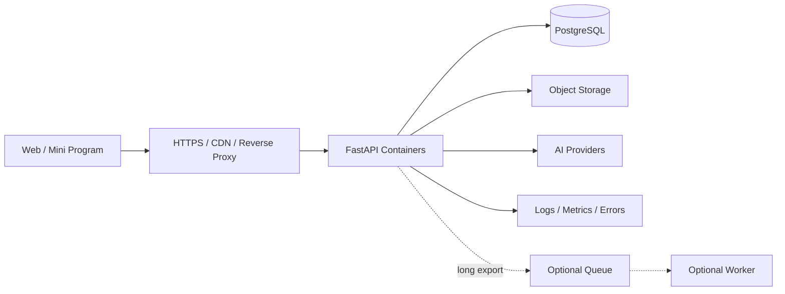

# Deployment and Rollback Runbook

> 状态：Proposed  
> 当前项目尚未完成生产部署条件。本 Runbook 定义目标流程，不能替代上线前演练。

## Environments

| Environment | Purpose | Data |
|---|---|---|
| Local | 开发和功能验证 | 本地假数据或脱敏数据 |
| Test | 自动测试 | 临时数据 |
| Staging | 上线前验收 | 脱敏、接近生产配置 |
| Production | 真实用户 | 受保护用户数据 |

## Target Topology



Worker 只在同步导出确实造成超时或并发压力后引入。

## Production Prerequisites

- [ ] 所有依赖可重复安装并锁定。
- [ ] 自动测试和 CI 通过。
- [ ] Alembic 迁移存在并经过升级验证。
- [ ] 用户认证和对象级授权。
- [ ] PostgreSQL 和对象存储。
- [ ] Secret Store。
- [ ] CORS 白名单、HTTPS、限流和安全 Header。
- [ ] 上传大小、类型和恶意文件控制。
- [ ] 日志脱敏、监控和告警。
- [ ] 隐私政策、用户协议和删除流程。
- [ ] 数据库备份恢复演练。
- [ ] 回滚或前滚方案。

## Build

前端：

```powershell
Set-Location frontend
npm.cmd ci
npm.cmd run lint
npm.cmd run build
```

后端：

```powershell
Set-Location backend
python -m venv .venv
.\.venv\Scripts\python.exe -m pip install -r requirements.txt
.\.venv\Scripts\python.exe -m compileall app
```

生产制品必须标注 Git commit SHA，不能在服务器直接修改源码。

## Deploy

1. 确认发布 tag、commit 和 CI。
2. 备份数据库并验证备份可读。
3. 在 staging 执行数据库迁移。
4. 部署 API 和前端。
5. 运行 smoke test。
6. 批准生产部署。
7. 生产执行兼容性迁移。
8. 部署应用制品。
9. 检查健康、错误率、延迟、AI 调用和导出。
10. 记录部署人、时间、版本和结果。

## Smoke Test

- `/health` 返回成功。
- 登录和身份有效。
- 创建、读取、更新、删除只作用于当前用户数据。
- AI 请求成功和失败路径可控。
- 上传限制生效。
- PDF/JSON 导出成功。
- 下载 URL 不泄漏内部路径。
- 日志不包含 Token 和完整简历。

## Database Changes

- 使用 Expand/Contract。
- 部署前审查迁移 SQL。
- 大表修改先在 staging 和接近生产规模数据验证。
- 不修改已发布迁移。
- 优先前滚修复，不假设数据库可简单回滚。

## Rollback

无数据库不兼容变更时：

1. 将流量切回上一稳定制品。
2. 验证 health 和核心流程。
3. 保留故障版本日志与指标。

存在数据库变更时：

- 应用必须在迁移窗口内兼容新旧结构。
- 若无法安全回退，部署前滚修复。
- 禁止未经评估直接恢复旧数据库覆盖新数据。

## Post-Deploy

- 观察至少一个约定窗口。
- 对比错误率、延迟、AI 成本、导入导出失败率。
- 更新发布记录。
- 若发生异常，执行 [故障响应](incident-response.md)。

